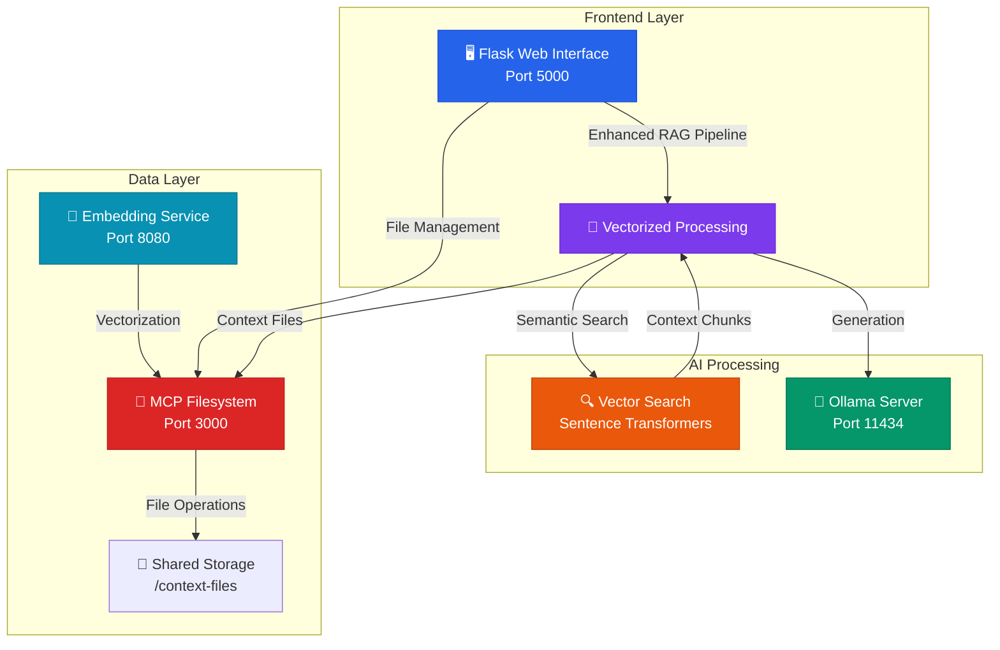

# (OL-MCP) Local AI Stack 

<div align="center">

<!-- Logo Placeholder -->


[](https://opensource.org/licenses/MIT)
[](https://github.com/trevino293/local_ai_stack/issues)
[](https://github.com/trevino293/local_ai_stack/stargazers)
[](https://github.com/trevino293/local_ai_stack/network)
[](https://github.com/trevino293/local_ai_stack/commits)

[](https://docs.docker.com/compose/)
[](https://python.org)
[](https://nodejs.org)
[](https://ollama.ai)

**🏠 Self-hosted AI chat interface with vectorized RAG pipeline and enhanced reasoning capabilities**

[Quick Start](#-quick-start) • [Features](#-features) • [Architecture](#-architecture) • [Documentation](#-documentation) • [Contributing](#-contributing)

</div>

---

## 🎥 Demo Video

<!-- Video Demo Placeholder -->
<div align="center">
  <a href="https://youtu.be/demo-video-placeholder">
    
  </a>
  <p><em>Click to watch the full demo on YouTube</em></p>
</div>

---

## ✨ Features

### 🧠 **Advanced AI Processing**
- **Vectorized RAG Pipeline** with semantic search capabilities
- **Two-Stage Deliberation** system for transparent reasoning
- **Multi-Step Reasoning** with 6-stage problem analysis
- **Confidence Scoring** (1-10) with detailed breakdowns
- **Citation Tracking** with automatic source references

### 🎨 **Modern Interface**
- **Enhanced Web UI** with dark blue theme and responsive design
- **Interactive Reasoning** with collapsible thought processes
- **Real-Time Chat History** with enhanced metadata display
- **Advanced Parameter Configuration** with presets and saved configurations
- **Context File Management** with system/user file distinction

### ⚙️ **System Architecture**
- **Containerized Deployment** using Docker Compose
- **MCP Filesystem Server** for context file management
- **Real-Time Status Monitoring** for all services
- **Persistent Configuration Storage** for model parameters
- **GPU Acceleration** support for faster inference

### 🔍 **Vectorization & Search**
- **Semantic Search** using sentence transformers
- **Chunk-Based Processing** for efficient context retrieval
- **Similarity Scoring** with configurable thresholds
- **Fast/Detailed Modes** for different use cases
- **Context Optimization** based on relevance ranking

---

## 🏗️ System Architecture

<div align="center">



</div>

### 🔄 **Enhanced RAG Pipeline Flow**

```
┌─ User Query ─┐
│              │
▼              │
🔍 Semantic Search ──┐
│                    │
▼                    │
📊 Context Ranking   │
│                    │
▼                    │
🧠 Deliberation ─────┘
│
▼
💡 Response Generation
│
▼
📝 Enhanced Output
```

---

## 🚀 Quick Start

### Prerequisites
- **Docker & Docker Compose** (latest versions)
- **8GB+ RAM** recommended
- **NVIDIA GPU + drivers** (optional, for acceleration)

### 📦 Installation

```bash
# 1. Clone the repository
git clone https://github.com/trevino293/local_ai_stack.git
cd local_ai_stack

# 2. Create necessary directories
mkdir -p shared-data/context-files
mkdir -p assets  # For logo and demo assets

# 3. Start all services
docker-compose up -d

# 4. Install your first model
docker exec ollama-server ollama pull llama3.2

# 5. Access the interface
open http://localhost:5000
```

### 🎯 **Quick Commands**

```bash
# Check service status
docker-compose ps

# View logs
docker-compose logs -f flask-app

# Rebuild specific service
docker-compose build --no-cache flask-app

# Install additional models
docker exec ollama-server ollama pull mistral
docker exec ollama-server ollama pull codellama

# Shutdown
docker-compose down
```

---

## 🔬 Advanced Features

### **Vectorized RAG Pipeline**

The system now includes advanced vectorization capabilities:

#### **🎯 Semantic Search Engine**
```python
# Fast Mode: Optimized for speed
response = rag_pipeline.process_query(
    model="llama3.2",
    message="Your question",
    fast_mode=True  # Uses top-3 semantic chunks
)

# Detailed Mode: Comprehensive analysis
response = rag_pipeline.process_query(
    model="llama3.2", 
    message="Your question",
    fast_mode=False  # Uses top-5 chunks + analysis
)
```

#### **📊 Search Configuration**
- **Similarity Threshold**: 0.3 (configurable)
- **Top-K Results**: 3-5 chunks per query
- **Embedding Model**: `sentence-transformers/all-MiniLM-L6-v2`
- **Vector Dimensions**: 384

#### **🧠 Multi-Stage Reasoning**
1. **🔍 Problem Decomposition** - Break down complex queries
2. **📊 Evidence Gathering** - Rank and select relevant sources  
3. **🧠 Pattern Identification** - Recognize reasoning patterns
4. **💡 Hypothesis Formation** - Generate potential approaches
5. **✅ Verification** - Validate logic and completeness
6. **📝 Synthesis** - Combine insights into final response

---

## ⚙️ Configuration

### **Model Parameters**

<table>
<tr>
<th>Parameter</th>
<th>Range</th>
<th>Description</th>
<th>Presets</th>
</tr>
<tr>
<td><strong>Temperature</strong></td>
<td>0.0 - 2.0</td>
<td>Controls randomness and creativity</td>
<td>🎨 Creative: 1.2<br/>⚖️ Balanced: 0.7<br/>🎯 Precise: 0.2</td>
</tr>
<tr>
<td><strong>Top P</strong></td>
<td>0.0 - 1.0</td>
<td>Nucleus sampling threshold</td>
<td>🎨 Creative: 0.95<br/>⚖️ Balanced: 0.9<br/>🎯 Precise: 0.7</td>
</tr>
<tr>
<td><strong>Top K</strong></td>
<td>1 - 100</td>
<td>Vocabulary limitation</td>
<td>🎨 Creative: 50<br/>⚖️ Balanced: 40<br/>🎯 Precise: 20</td>
</tr>
</table>

### **Environment Variables**

```yaml
# Core Services
OLLAMA_HOST: http://ollama:11434
MCP_SERVER_URL: http://mcp-filesystem:3000  
EMBEDDING_SERVICE_URL: http://embedding-service:8080

# Processing Modes
DEFAULT_FAST_MODE: true
SEMANTIC_SEARCH_THRESHOLD: 0.3
MAX_CONTEXT_CHUNKS: 5

# GPU Support (uncomment to enable)
# NVIDIA_VISIBLE_DEVICES: all
```

---

## 📚 Usage Examples

### **💬 Enhanced Chat Interface**

```javascript
// Send message with vectorized processing
const response = await sendMessage({
    message: "Explain quantum computing",
    contextFiles: ["quantum-basics.pdf", "research-notes.md"],
    fastMode: false,  // Use detailed reasoning
    modelParams: {
        temperature: 0.7,
        confidence_threshold: 8
    }
});

// Response includes:
// - Enhanced reasoning chain
// - Confidence breakdowns  
// - Source citations
// - Semantic relevance scores
```

### **🔍 Context File Management**

```bash
# Upload context files
curl -X POST -F "file=@document.pdf" http://localhost:5000/api/files

# Search semantic content
curl -X POST http://localhost:3000/search \
    -H "Content-Type: application/json" \
    -d '{"query": "machine learning", "topK": 5}'

# Get file analysis
curl http://localhost:5000/api/files/document.pdf/analysis
```

### **🎯 Model Management**

```bash
# List available models with details
docker exec ollama-server ollama list

# Install specialized models
docker exec ollama-server ollama pull codellama      # Code generation
docker exec ollama-server ollama pull mistral       # General purpose
docker exec ollama-server ollama pull phi3          # Lightweight
docker exec ollama-server ollama pull llava         # Vision + text

# Monitor GPU usage
docker exec ollama-server nvidia-smi
```

---

## 🛠️ Development

### **🔧 Local Development Setup**

```bash
# Backend services (without Docker)
cd flask-app && pip install -r requirements.txt && python app.py &
cd mcp-server && npm install && npm start &
cd embedding-service && pip install -r requirements.txt && python simple_embedding_service.py &

# Start Ollama locally
ollama serve
```

### **🧪 Testing Pipeline**

```bash
# Test vectorization
curl -X POST http://localhost:8080/embed \
    -H "Content-Type: application/json" \
    -d '{"text": "Test embedding generation"}'

# Test semantic search  
curl -X POST http://localhost:3000/search \
    -H "Content-Type: application/json" \
    -d '{"query": "artificial intelligence", "topK": 3}'

# Test enhanced RAG
curl -X POST http://localhost:5000/api/chat \
    -H "Content-Type: application/json" \
    -d '{"message": "Test query", "fast_mode": false}'
```

---

## 🔍 Troubleshooting

<details>
<summary><strong>🚨 Common Issues & Solutions</strong></summary>

### **Services Not Starting**
```bash
# Check Docker resources
docker system df
docker system prune  # Clean up if needed

# Restart specific service
docker-compose restart flask-app
docker-compose logs flask-app
```

### **Embedding Service Issues**
```bash
# Check embedding service health
curl http://localhost:8080/health

# Restart embedding service
docker-compose restart embedding-service
```

### **GPU Acceleration Problems**
```bash
# Test NVIDIA Docker runtime
docker run --rm --gpus all nvidia/cuda:11.0-base nvidia-smi

# Check Ollama GPU usage
docker exec ollama-server ollama ps
```

### **Search Performance Issues**
```bash
# Check vector index status
curl http://localhost:3000/status

# Monitor search performance
curl http://localhost:3000/search/stats
```

</details>

---

## 📖 Documentation

### **📋 API Reference**

<details>
<summary><strong>🔌 Complete API Endpoints</strong></summary>

#### **Chat & Processing**
- `POST /api/chat` - Enhanced chat with vectorized RAG
- `GET /api/chat/history` - Retrieve conversation history
- `DELETE /api/chat/history` - Clear chat history

#### **Vectorization & Search**  
- `POST /api/search` - Semantic search in context files
- `GET /api/search/stats` - Search performance metrics
- `POST /embed` - Generate text embeddings

#### **File Management**
- `GET /api/files` - List context files
- `POST /api/files` - Upload file with auto-vectorization
- `DELETE /api/files/{filename}` - Delete file and vectors

#### **Model & Configuration**
- `GET /api/models` - List available Ollama models
- `POST /api/model-params` - Save model parameters
- `GET /api/saved-configs` - List saved configurations

</details>

### **🎯 Performance Benchmarks**

| Operation | Fast Mode | Detailed Mode | Notes |
|-----------|-----------|---------------|--------|
| **Simple Query** | ~2-3s | ~5-7s | Basic factual questions |
| **Complex Analysis** | ~4-6s | ~10-15s | Multi-step reasoning |  
| **With 10+ Files** | ~3-5s | ~8-12s | Semantic search overhead |
| **GPU Acceleration** | ~50% faster | ~60% faster | With NVIDIA GPU |

---

## 🔒 Security & Privacy

### **🛡️ Security Features**
- **🏠 Local Processing** - No data leaves your infrastructure
- **🔐 System File Protection** - Critical files cannot be deleted
- **📁 Isolated Workspaces** - Containerized file access
- **🚫 No External APIs** - Complete offline operation

### **⚠️ Production Considerations**
```yaml
# Add for production deployment
security:
  - Authentication layer (OAuth, JWT)
  - HTTPS termination
  - Rate limiting  
  - Input validation
  - Audit logging
```

---

## 🤝 Contributing

We welcome contributions! Here's how to get started:

### **🚀 Quick Contribution Guide**

1. **Fork** the repository
2. **Create** a feature branch: `git checkout -b feature/amazing-feature`
3. **Commit** your changes: `git commit -m 'Add amazing feature'`
4. **Push** to the branch: `git push origin feature/amazing-feature`
5. **Open** a Pull Request

### **📝 Development Guidelines**
- Follow existing code style and patterns
- Add comprehensive tests for new features
- Update documentation for API changes
- Test with multiple models and configurations

### **🎯 Areas for Contribution**
- 🔍 **Vectorization improvements** (new embedding models, search algorithms)
- 🧠 **Reasoning enhancements** (additional deliberation stages)
- 🎨 **UI/UX improvements** (mobile responsiveness, accessibility)
- 📊 **Performance optimizations** (caching, async processing)
- 🔒 **Security features** (authentication, authorization)

---

## 📄 License

<div align="center">

**MIT License** © 2025 Local AI Stack Contributors

*Permission is hereby granted, free of charge, to any person obtaining a copy of this software and associated documentation files (the "Software"), to deal in the Software without restriction, including without limitation the rights to use, copy, modify, merge, publish, distribute, sublicense, and/or sell copies of the Software.*

[View Full License](LICENSE.md)

</div>

---

## 🙏 Acknowledgments

<div align="center">

**Built with amazing open-source technologies:**

[](https://ollama.ai/)
[](https://flask.palletsprojects.com/)
[](https://www.docker.com/)
[](https://huggingface.co/sentence-transformers)

*Special thanks to the open-source AI community for inspiration and tools* 🌟

</div>

---

<div align="center">

### 🌟 **Star this repo if you find it useful!** ⭐

[](https://github.com/trevino293/local_ai_stack/stargazers)
[](https://github.com/trevino293/local_ai_stack/network)

**[⬆ Back to Top](#local-ai-stack-ol-mcp-)**

</div>